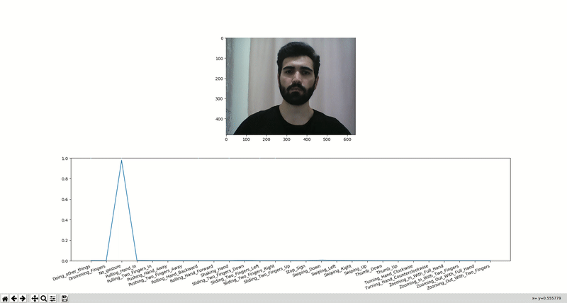

# Dynamic gesture recognition on rgb video

## Dynamic hand gestures dataset

[Link](https://20bn.com/datasets/jester/)

---
## Models

* [x] CNN + LSTM RGB (%89 accuracy)

* [ ] CNN + LSTM opticalflow

* [ ] merged model RGB + FLOW

---
## CNN + LSTM RGB
[paper](https://arxiv.org/abs/1411.4389)

---
# Results

